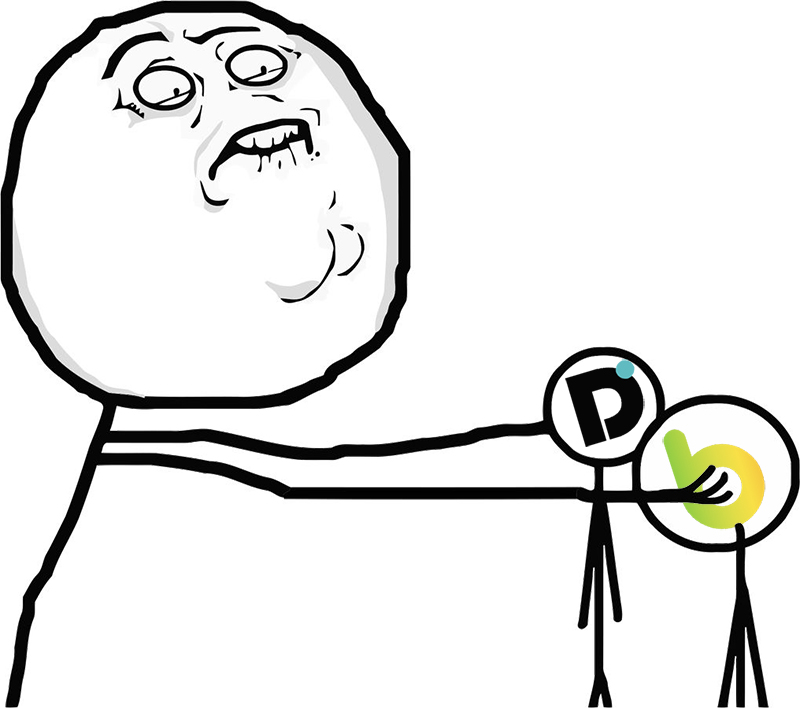

# Docclibarr

**Module Dolibarr pour ingérer automatiquement les factures électroniques Doccle (Peppol / UBL) reçues par email, et proposer leur rattachement aux factures fournisseurs, toujours avec validation humaine avant toute écriture.**

Doccle ne propose aucune API pour récupérer les factures reçues par ce canal : le seul moyen de les obtenir est l'email que le réseau Peppol envoie automatiquement à réception d'une facture destinée à l'entreprise, avec deux pièces jointes, le PDF de la facture et son équivalent structuré en XML (UBL 2.1 / Peppol BIS Billing 3.0). Docclibarr automatise ce qui serait sinon un classement manuel de cette boîte mail : il lit la boîte, vérifie que chaque message provient authentiquement de Doccle (DKIM/DMARC), extrait les données du XML, et propose un rattachement à la facture fournisseur Dolibarr correspondante, sans jamais créer ni lier quoi que ce soit en base sans confirmation explicite d'un humain.

_Une API Doccle aurait réglé ça en un `GET /invoices` et ce module n'existerait pas. Faute de mieux (côté Doccle comme côté logiciels de compta abordables qui proposeraient nativement l'ingestion Peppol), Docclibarr sort l'artillerie lourde (vérification DKIM/DMARC en règle, parsing XPath namespace-aware, moteur de matching en cascade) pour faire à coups de regex et d'en-têtes email ce qu'un vrai point d'accès aurait fait en une requête. Doccle, j'aime votre solution, mais par pitié, une API..._

Docclibarr est un module à part entière, distinct du module d'**import bancaire** existant [DoliFius](https://github.com/LgHS/DoliFius) : il s'appuie sur les mêmes conventions de code, mais ne modifie pas et ne dépend pas de son code. Les deux modules répondent à la même contrainte de fond (un fournisseur externe sans API, seulement un flux à parser) appliquée à deux sources différentes : les extraits Belfius en CSV pour DoliFius, les factures Peppol/Doccle en email pour Docclibarr.

## Statut

🚧 **En développement.** Le squelette du module (Phase 1 et 2) est écrit et testé (29 tests PHPUnit sur la logique pure, activation confirmée sur une instance de dev), l'ingestion réelle contre de vraies factures est en cours de validation. Voir la roadmap ci-dessous pour le détail des phases.

## Fonctionnement prévu

- Surveillance de la boîte Gmail dédiée (notification push Pub/Sub + cron de secours), identification idempotente par `Message-ID`.
- Vérification stricte de l'origine sur les en-têtes bruts du message : domaine `From` = `doccle.be`, DKIM `dkim=pass header.i=@doccle.be`, DMARC `dmarc=pass header.from=doccle.be`. Un message qui ne remplit pas ces trois conditions part en quarantaine, jamais traité automatiquement.
- Extraction des données de facture depuis le XML (numéro, dates, TVA fournisseur, montants HTVA/TTC, communication structurée, IBAN bénéficiaire) par parsing DOM/XPath conscient des namespaces.
- Proposition de rattachement à une facture fournisseur Dolibarr existante, scorée en cascade : communication structurée exacte, puis TVA + montant + fenêtre de date, puis aucune correspondance (traitement manuel).
- Dashboard de validation : chaque facture entrante est présentée avec sa proposition de rattachement, le PDF prévisualisable, et les actions valider / rattacher manuellement / créer un brouillon de facture / rejeter avec motif.

## Prérequis (prévisionnel)

- Dolibarr 22.x.
- PHP 7.2 ou supérieur.
- Un compte Gmail/Google Workspace dédié avec l'API Gmail activée (OAuth2 utilisateur classique, scope lecture seule). Un support IMAP pourrait être envisagé plus tard, en alternative ou en complément, pour couvrir une boîte mail hébergée ailleurs que sur Google Workspace.
- Composer, pour la librairie cliente Gmail officielle (`google/apiclient`). Contrairement à DoliFius qui n'a aucune dépendance externe, ce module en introduit une, rendue nécessaire par l'API Gmail.

## Installation

1. Générez le zip déployable avec `bash scripts/build-zip.sh` (dépendances de production incluses, fichiers de dev exclus), ou téléchargez un zip déjà généré.
2. **Configuration → Modules/Applications → Déployer un module externe**, ou copiez le dossier manuellement dans `custom/` de votre instance Dolibarr.
   > ⚠️ Le dossier doit impérativement s'appeler `docclibarr` (le nom technique utilisé partout dans le code : `rights_class`, `langfiles`, menu, URL de config). Un zip dont le dossier racine porte un autre nom casse les liens de menu et de configuration (même gotcha déjà rencontré sur DoliFius).
3. Activez le module depuis la liste des modules.
4. **Donnez les permissions** : l'activation d'un module ne donne aucun droit automatiquement, même à un administrateur. Profil utilisateur → onglet Permissions → section Docclibarr, cochez "Consulter" et "Valider", puis déconnectez-vous/reconnectez-vous.

## Configuration de la boîte mail dédiée et de l'API Gmail

Docclibarr a besoin de trois choses : l'adresse de la boîte mail dédiée, des identifiants OAuth Gmail, et un refresh token généré une fois. Rien de tout ça ne se code en dur, tout se configure depuis la page de configuration du module (icône clé à molette dans la liste des modules, ou `admin/setup.php`).

**1. Créer la boîte dédiée**

Dans l'admin Google Workspace, créez un utilisateur avec une adresse longue et non devinable (jamais un mot du dictionnaire, jamais un préfixe type `compta-IDLONG@`, voir la section Sécurité plus bas). Cette boîte ne sert qu'à l'API, jamais à une connexion interactive au quotidien.

**2. Créer un projet Google Cloud et activer l'API Gmail**

Sur [console.cloud.google.com](https://console.cloud.google.com) : créez un projet, puis *API et services → Bibliothèque*, cherchez "Gmail API", activez-la.

**3. Configurer l'écran de consentement OAuth**

*API et services → Écran de consentement OAuth*. Type **Interne** (visible uniquement aux comptes de votre Workspace, aucune vérification Google à faire). Renseignez juste un nom d'app et un email de contact.

**4. Créer des identifiants OAuth**

*API et services → Identifiants → Créer des identifiants → ID client OAuth*. Type **Application Web**, avec comme URI de redirection autorisée exactement : `https://developers.google.com/oauthplayground`. Notez le Client ID et le Client Secret générés.

**5. Générer le refresh token**

Sur [developers.google.com/oauthplayground](https://developers.google.com/oauthplayground/) : icône ⚙️ → cochez "Use your own OAuth credentials" → collez le Client ID/Secret de l'étape 4. Dans la colonne de gauche, tout en bas, champ "Input your own scopes" : collez `https://www.googleapis.com/auth/gmail.readonly`, cliquez "Authorize APIs". **Connectez-vous avec le compte de la boîte dédiée** (étape 1), pas votre compte perso : c'est ce compte, et uniquement lui, qui détermine à quelle boîte le jeton final donnera accès. Une fois autorisé, cliquez "Exchange authorization code for tokens", le **Refresh token** apparaît dans le panneau de droite.

**6. Tout renseigner dans Docclibarr**

Adresse de la boîte (étape 1), Client ID et Client Secret (étape 4), Refresh token (étape 5), dans la page de configuration du module. Le bouton **"Tester la connexion"** confirme que tout fonctionne (adresse + nombre de messages dans la boîte) sans avoir à attendre un cycle complet du cron d'ingestion.

**7. Activer la tâche cron**

*Configuration → Outils admin → Travaux planifiés*, cherchez `DocclibarrIngestionWorker` (désactivée par défaut à l'activation du module, pour éviter qu'elle tourne dans le vide avant que la config Gmail existe). Cochez-la, réglez la fréquence si besoin (15 minutes par défaut), et configurez le déclencheur d'exécution périodique côté serveur (crontab système appelant `scripts/cron/cron_run_jobs.php`, ou webcron externe si vous n'avez pas la main sur le crontab). Le bouton "Exécuter maintenant" de cette même page permet un premier test manuel immédiat, sans attendre le prochain cycle.

## Tests

Deux niveaux, volontairement séparés.

**Tests automatisés (`tests/`, committés)** : couvrent `OriginVerifier`, `UblInvoiceParser`, `MimeAttachmentExtractor` et `InvoiceMatcher`, la logique pure sans dépendance à Dolibarr ni à l'API Gmail. Fixtures entièrement fictives (noms, TVA, IBAN, communications structurées inventés), aucune donnée réelle. `composer install` puis `./vendor/bin/phpunit`.

**Validation contre de vrais emails, jamais committée.** À un moment du développement, la meilleure façon de vérifier que le parsing tient sur du vrai XML (et pas seulement sur des fixtures imaginées) a été d'exporter un lot d'emails réels depuis Gmail (menu ⋮ → "Télécharger le message") couvrant plusieurs cas : des factures Peppol reçues via Doccle, des emails Doccle sans facture jointe (notifications, support), des factures reçues directement d'un fournisseur sans passer par Doccle, et du courrier complètement sans rapport (spam, listes de diffusion). Les fichiers `.eml` ont été déposés dans `tests/fixtures/real/` (`.eml` est exclu du dépôt par `.gitignore`, sans exception, ce dossier ne quitte jamais la machine locale) puis passés directement dans un petit script PHP appelant les classes du module, sans passer par Gmail ni par Dolibarr.

Cette étape a fait remonter des cas que les fixtures synthétiques n'avaient pas anticipés, corrigés depuis :
- Un vrai XML Doccle n'avait pas de TVA client du tout, ce que le garde-fou anti-usurpation traitait à tort comme une tentative d'usurpation.
- Un email Doccle contenait une note de crédit UBL (`CreditNote`), pas une facture (`Invoice`), un type de document jusque-là non prévu.
- La vraie adresse d'expédition Doccle (`community@doccle.be`) a pu être confirmée telle quelle plutôt que supposée.

Pour refaire cette validation avec de nouveaux échantillons : déposez les `.eml` dans `tests/fixtures/real/`, ils resteront locaux automatiquement.

## Roadmap

- [x] **Phase 1** : Ingestion des emails, vérification d'origine, parsing XML, stockage en table de staging, dashboard en lecture seule. Code écrit et activation testée sur l'instance de dev, l'ingestion réelle reste à valider une fois les identifiants Gmail configurés.
- [x] **Phase 2** : Moteur de matching en cascade, actions de validation humaine dans le dashboard, rattachement définitif aux factures fournisseurs. Code écrit, pas encore testé contre de vraies factures.
- [ ] **Phase 3** : Alertes IBAN (écart avec l'historique fournisseur), notification en cas de facture en quarantaine, extension à d'autres plateformes de facturation électronique, et éventuellement un support IMAP en complément de l'API Gmail.

## Sécurité

Toute écriture comptable ou tout rattachement d'objet Dolibarr est systématiquement soumis à validation humaine explicite, sans exception liée au niveau de confiance du matching : c'est la protection principale contre une facture frauduleuse avec un IBAN falsifié. Chaque validation ou rejet est journalisé avec l'utilisateur Dolibarr et l'horodatage.
